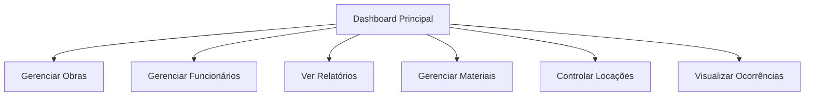

# Requisitos para Melhoria do Dashboard - Sistema de Gerenciamento de Obras

## 1. Visão Geral do Produto

O Sistema de Gerenciamento de Obras precisa de uma página inicial (dashboard) mais profissional, visualmente atrativa e rica em informações. O dashboard atual é muito simples e não aproveita adequadamente os dados disponíveis no sistema. A nova versão deve manter todas as funcionalidades existentes enquanto oferece uma experiência visual superior e insights valiosos através de gráficos e estatísticas em tempo real.

## 2. Funcionalidades Principais

### 2.1 Papéis de Usuário

| Papel | Método de Acesso | Permissões Principais |
|-------|------------------|----------------------|
| Usuário Padrão | Acesso direto ao sistema | Visualizar dashboard completo, navegar para todas as seções principais |

### 2.2 Módulos de Funcionalidade

Nossos requisitos de melhoria do dashboard consistem nas seguintes páginas principais:

1. **Dashboard Principal**: seção hero com título, navegação rápida, estatísticas visuais, gráficos interativos, imagem de fundo.

### 2.3 Detalhes das Páginas

| Nome da Página | Nome do Módulo | Descrição da Funcionalidade |
|----------------|----------------|-----------------------------|
| Dashboard Principal | Seção Hero | Exibir título "Sistema de Gerenciamento de Obras" em destaque com imagem de fundo relacionada à construção |
| Dashboard Principal | Navegação Rápida | Botões de acesso direto às principais páginas: Obras, Funcionários, Relatórios, Materiais, Locações |
| Dashboard Principal | Cards de Estatísticas | Mostrar métricas principais: obras ativas, funcionários ativos (30 dias), custo total do mês |
| Dashboard Principal | Gráfico de Custos | Visualizar divisão de custos entre despesas e locações com gráfico de pizza ou barras |
| Dashboard Principal | Gráfico de Atividade | Mostrar equipes e funcionários ativos nos últimos 30 dias em gráfico de linha temporal |
| Dashboard Principal | Painel de Ocorrências | Exibir quantidade e lista de incidentes/ocorrências registradas nos últimos 30 dias |
| Dashboard Principal | Resumo de Obras | Mostrar status das obras ativas com indicadores visuais de progresso |

## 3. Processo Principal

O usuário acessa o dashboard e imediatamente visualiza uma interface profissional com:
1. Imagem de fundo atrativa relacionada à construção
2. Título do sistema em destaque no centro superior
3. Botões de navegação rápida organizados horizontalmente
4. Cards com estatísticas principais dispostos em grid responsivo
5. Gráficos interativos mostrando dados dos últimos 30 dias
6. Painel de ocorrências recentes para monitoramento
7. Acesso rápido às funcionalidades mais utilizadas

## 4. Design da Interface do Usuário

### 4.1 Estilo de Design

- **Cores Primárias**: Azul profissional (#2563eb), Verde construção (#16a34a), Cinza moderno (#64748b)
- **Cores Secundárias**: Laranja destaque (#ea580c), Branco (#ffffff), Cinza claro (#f1f5f9)
- **Estilo dos Botões**: Arredondados com sombra sutil, efeitos hover suaves
- **Fonte**: Inter ou similar, tamanhos 14px (texto), 18px (subtítulos), 24px+ (títulos)
- **Layout**: Grid responsivo com cards, navegação horizontal superior
- **Ícones**: Heroicons ou Lucide com estilo outline, cores consistentes com o tema

### 4.2 Visão Geral do Design das Páginas

| Nome da Página | Nome do Módulo | Elementos da UI |
|----------------|----------------|----------------|
| Dashboard Principal | Seção Hero | Imagem de fundo com overlay gradiente, título centralizado em fonte bold 32px, altura 300px |
| Dashboard Principal | Navegação Rápida | 5 botões em grid horizontal, ícones coloridos, texto descritivo, hover com elevação |
| Dashboard Principal | Cards Estatísticas | Grid 3 colunas responsivo, fundo branco, sombra sutil, ícones temáticos, números em destaque |
| Dashboard Principal | Gráficos | Containers com fundo branco, títulos descritivos, cores consistentes, tooltips interativos |
| Dashboard Principal | Painel Ocorrências | Lista compacta, badges de status, timestamps, scroll vertical se necessário |

### 4.3 Responsividade

O dashboard é desktop-first com adaptação completa para mobile. Em dispositivos móveis, os cards se reorganizam em coluna única, gráficos se ajustam automaticamente, e a navegação se torna mais compacta. Otimização para touch em todos os elementos interativos.