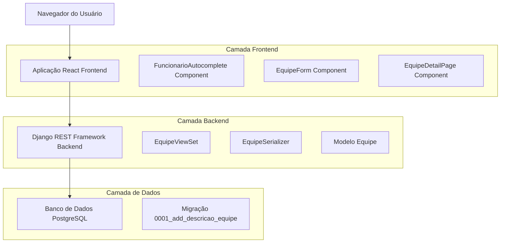
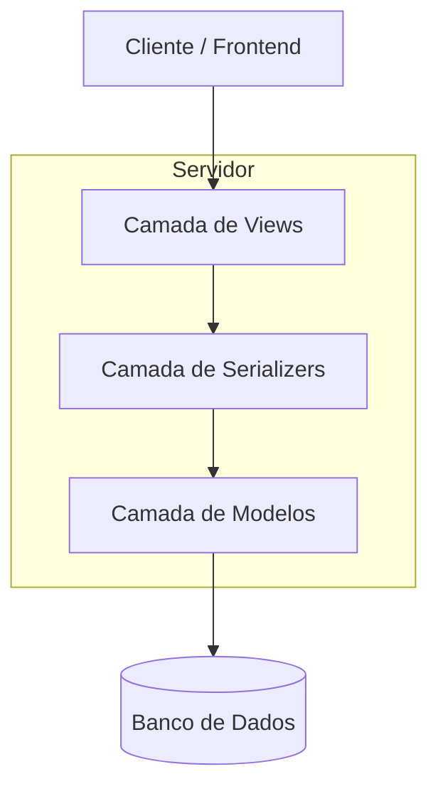
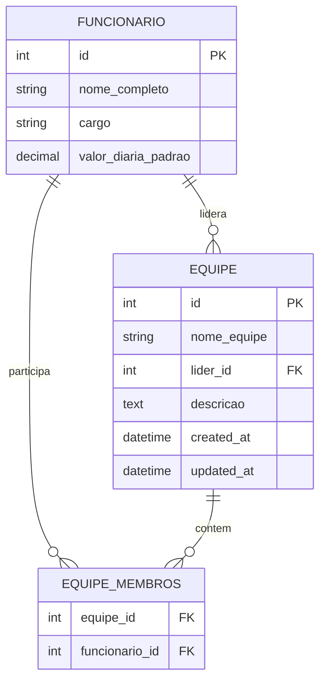

# Melhorias no Sistema de Equipes - Arquitetura Técnica

## 1. Design da Arquitetura



## 2. Descrição das Tecnologias

* **Frontend**: React\@18 + TailwindCSS\@3 + Vite

* **Backend**: Django REST Framework + PostgreSQL

* **Componentes**: FuncionarioAutocomplete (reutilização), EquipeForm (modificado)

## 3. Definições de Rotas

| Rota               | Propósito                                                         |
| ------------------ | ----------------------------------------------------------------- |
| /equipes           | Página principal de gestão de equipes com modal de criação/edição |
| /equipes/:id       | Página de detalhes da equipe com descrição expandida              |
| /api/equipes/      | Endpoint REST para CRUD de equipes                                |
| /api/funcionarios/ | Endpoint para busca de funcionários com filtro de texto           |

## 4. Definições da API

### 4.1 API Principal

**Busca de funcionários para autocompletar**

```
GET /api/funcionarios/?search={termo}
```

Request:

| Nome do Parâmetro | Tipo do Parâmetro | Obrigatório | Descrição                                         |
| ----------------- | ----------------- | ----------- | ------------------------------------------------- |
| search            | string            | false       | Termo de busca para filtrar funcionários por nome |
| page              | integer           | false       | Número da página para paginação                   |

Response:

| Nome do Parâmetro | Tipo do Parâmetro | Descrição                         |
| ----------------- | ----------------- | --------------------------------- |
| results           | array             | Lista de funcionários filtrados   |
| count             | integer           | Total de funcionários encontrados |

Exemplo:

```json
{
  "results": [
    {
      "id": 1,
      "nome_completo": "João Silva",
      "cargo": "Pedreiro"
    }
  ],
  "count": 1
}
```

**Criação/Atualização de equipe**

```
POST/PUT /api/equipes/
```

Request:

| Nome do Parâmetro | Tipo do Parâmetro | Obrigatório | Descrição                          |
| ----------------- | ----------------- | ----------- | ---------------------------------- |
| nome\_equipe      | string            | true        | Nome da equipe                     |
| lider             | integer           | false       | ID do funcionário líder            |
| membros           | array             | false       | Array de IDs dos membros da equipe |
| descricao         | string            | false       | Descrição detalhada da equipe      |

Response:

| Nome do Parâmetro | Tipo do Parâmetro | Descrição                          |
| ----------------- | ----------------- | ---------------------------------- |
| id                | integer           | ID da equipe criada/atualizada     |
| nome\_equipe      | string            | Nome da equipe                     |
| lider             | object            | Dados básicos do líder             |
| membros           | array             | Lista de membros com dados básicos |
| descricao         | string            | Descrição da equipe                |

Exemplo:

```json
{
  "nome_equipe": "Equipe de Construção A",
  "lider": 1,
  "membros": [2, 3, 4],
  "descricao": "Equipe especializada em construção de fundações e estruturas de concreto armado."
}
```

## 5. Arquitetura do Servidor



## 6. Modelo de Dados

### 6.1 Definição do Modelo de Dados



### 6.2 Linguagem de Definição de Dados

**Migração para adicionar campo descrição**

```python
# Generated migration: 0001_add_descricao_equipe.py
from django.db import migrations, models

class Migration(migrations.Migration):
    dependencies = [
        ('core', '0000_previous_migration'),  # Substituir pelo nome da última migração
    ]
    
    operations = [
        migrations.AddField(
            model_name='equipe',
            name='descricao',
            field=models.TextField(blank=True, null=True, verbose_name='Descrição da Equipe'),
        ),
    ]
```

**Modelo Equipe atualizado**

```python
class Equipe(models.Model):
    nome_equipe = models.CharField(max_length=100, unique=True)
    lider = models.ForeignKey(
        Funcionario, 
        on_delete=models.SET_NULL, 
        null=True, 
        related_name='equipes_lideradas'
    )
    membros = models.ManyToManyField(
        Funcionario, 
        related_name='equipes_membro'
    )
    descricao = models.TextField(
        blank=True, 
        null=True, 
        verbose_name='Descrição da Equipe'
    )
    
    def __str__(self):
        return self.nome_equipe
```

**Serializer atualizado**

```python
class EquipeComMembrosBasicSerializer(serializers.ModelSerializer):
    membros = FuncionarioBasicSerializer(many=True, read_only=True)
    lider = FuncionarioBasicSerializer(read_only=True, allow_null=True)
    
    class Meta:
        model = Equipe
        fields = ['id', 'nome_equipe', 'lider', 'membros', 'descricao']

class EquipeDetailSerializer(serializers.ModelSerializer):
    membros = FuncionarioBasicSerializer(many=True, read_only=True)
    lider = FuncionarioBasicSerializer(read_only=True, allow_null=True)
    
    class Meta:
        model = Equipe
        fields = ['id', 'nome_equipe', 'lider', 'membros', 'descricao']
```

**Script de migração segura**

```python
# scripts/migrate_equipes_safely.py
import os
import django
from django.core.management import execute_from_command_line

def run_safe_migration():
    """Executa migração de forma segura preservando dados existentes"""
    try:
        # Fazer backup antes da migração
        print("Criando backup antes da migração...")
        execute_from_command_line(['manage.py', 'dbbackup'])
        
        # Executar migração
        print("Executando migração...")
        execute_from_command_line(['manage.py', 'migrate'])
        
        print("Migração concluída com sucesso!")
        return True
    except Exception as e:
        print(f"Erro durante migração: {e}")
        return False

if __name__ == '__main__':
    run_safe_migration()
```

**Atualização do config.bat**

```batch
@echo off
echo Executando migracao segura do sistema de equipes...
python scripts/migrate_equipes_safely.py
if %ERRORLEVEL% NEQ 0 (
    echo Erro na migracao. Verifique os logs.
    pause
    exit /b 1
)
echo Migracao concluida com sucesso!
```

