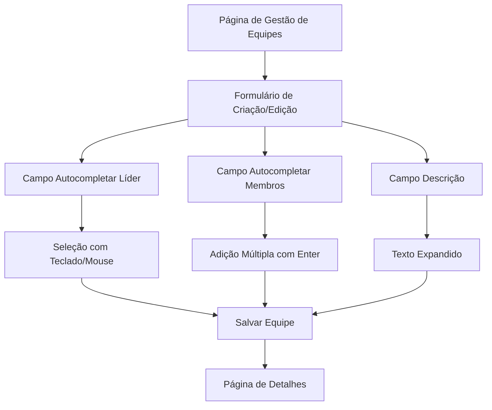

# Melhorias no Sistema de Equipes - Documento de Requisitos

## 1. Visão Geral do Projeto

Este documento especifica as melhorias necessárias no sistema de gestão de equipes, focando na implementação de campos de autocompletar para seleção de líder e membros, além da adição de um campo de descrição para as equipes. As alterações devem ser implementadas de forma consistente em todos os contextos de uso (criação, edição e visualização).

## 2. Funcionalidades Principais

### 2.1 Papéis de Usuário
| Papel | Método de Registro | Permissões Principais |
|-------|-------------------|----------------------|
| Administrador | Registro direto no sistema | Pode criar, editar, visualizar e excluir equipes |
| Gerente | Convite por administrador | Pode criar, editar, visualizar e excluir equipes |

### 2.2 Módulos de Funcionalidade

Nossas melhorias no sistema de equipes consistem nas seguintes páginas principais:
1. **Página de Gestão de Equipes**: listagem de equipes, botões de ação, modal de criação/edição.
2. **Página de Detalhes da Equipe**: visualização completa dos dados da equipe, incluindo descrição.
3. **Formulário de Equipe**: interface para criação e edição com campos de autocompletar.

### 2.3 Detalhes das Páginas

| Nome da Página | Nome do Módulo | Descrição da Funcionalidade |
|----------------|----------------|-----------------------------|
| Gestão de Equipes | Modal de Criação/Edição | Implementar autocompletar para líder, autocompletar para membros com seleção múltipla, campo de descrição expandido |
| Detalhes da Equipe | Seção de Informações | Exibir descrição da equipe, líder selecionado, lista de membros com navegação aprimorada |
| Formulário de Equipe | Campo de Líder | Substituir dropdown por autocompletar com busca em tempo real, navegação por teclado |
| Formulário de Equipe | Campo de Membros | Substituir checklist por autocompletar com adição múltipla, suporte a Enter para confirmação |
| Formulário de Equipe | Campo de Descrição | Adicionar textarea expandido para informações detalhadas da equipe |

## 3. Fluxo Principal

### Fluxo do Administrador/Gerente
1. Usuário acessa a página de Gestão de Equipes
2. Clica em "Adicionar Nova Equipe" ou "Editar" em uma equipe existente
3. No formulário, digita no campo de líder e vê sugestões filtradas
4. Seleciona líder usando teclado (setas + Enter) ou mouse
5. No campo de membros, digita nome do funcionário
6. Navega pelas sugestões com setas do teclado
7. Confirma seleção com Enter, membro é adicionado à lista
8. Repete processo para adicionar múltiplos membros
9. Preenche descrição detalhada da equipe
10. Salva equipe com todas as informações

## 4. Design da Interface do Usuário

### 4.1 Estilo de Design
- **Cores primárias**: Azul (#3B82F6) para elementos principais, cinza (#6B7280) para secundários
- **Estilo dos botões**: Arredondados com hover suave e estados de loading
- **Fonte**: Sistema padrão com tamanhos 14px (corpo), 16px (labels), 18px (títulos)
- **Layout**: Baseado em cards com espaçamento consistente, navegação superior
- **Ícones**: Estilo outline com animações sutis para loading e interações

### 4.2 Visão Geral do Design das Páginas

| Nome da Página | Nome do Módulo | Elementos da UI |
|----------------|----------------|----------------|
| Gestão de Equipes | Modal de Formulário | Campo autocompletar com dropdown animado, lista de sugestões com highlight, indicador de loading |
| Detalhes da Equipe | Seção de Descrição | Card expandido com texto formatado, seção de membros em grid responsivo |
| Formulário de Equipe | Campo de Líder | Input com ícone de busca, dropdown posicionado dinamicamente, navegação por teclado visual |
| Formulário de Equipe | Campo de Membros | Input com tags dos membros selecionados, botão de remoção por membro, contador de membros |

### 4.3 Responsividade
O sistema é desktop-first com adaptação para tablets e mobile, incluindo otimização para interação touch nos campos de autocompletar.
