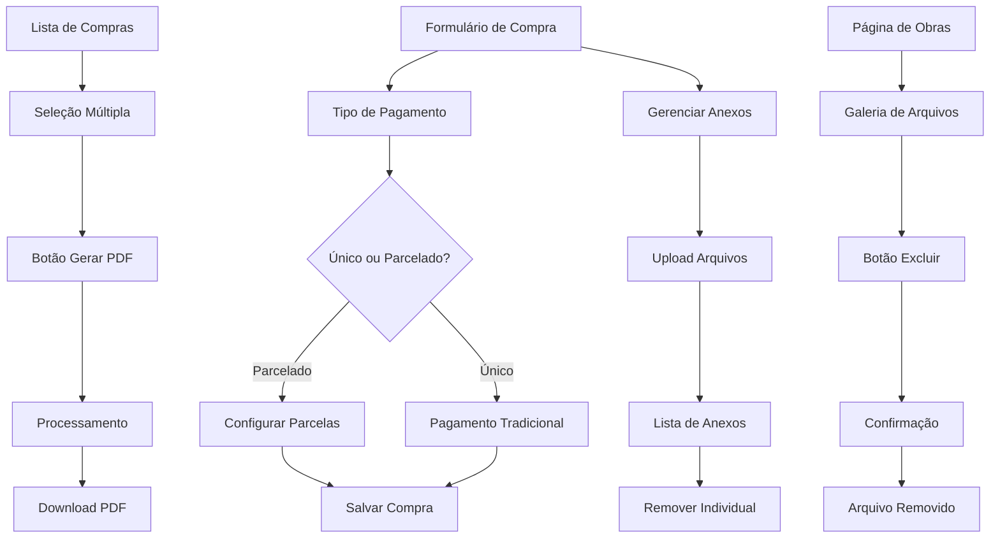

# Documento de Requisitos do Produto - Melhorias do Sistema

## 1. Visão Geral do Produto

Este documento especifica as melhorias a serem implementadas no sistema de gestão de obras, focando nas seções de compras e obras. As funcionalidades visam aumentar a flexibilidade financeira, melhorar o gerenciamento de documentos e otimizar a geração de relatórios para atender às necessidades operacionais dos usuários.

O objetivo é proporcionar maior controle sobre pagamentos parcelados, facilitar o anexo de documentos relevantes e permitir a geração eficiente de relatórios consolidados.

## 2. Funcionalidades Principais

### 2.1 Papéis de Usuário

| Papel          | Método de Registro      | Permissões Principais                                           |
| -------------- | ----------------------- | --------------------------------------------------------------- |
| Administrador  | Acesso total ao sistema | Pode criar, editar, excluir compras e gerenciar todos os anexos |
| Gerente        | Permissões de gestão    | Pode criar e editar compras, gerenciar anexos, gerar relatórios |
| Usuário Padrão | Acesso limitado         | Pode visualizar compras e anexos, sem permissões de edição      |

### 2.2 Módulos de Funcionalidades

Nossos requisitos de melhoria consistem nas seguintes páginas principais:

1. **Página de Compras**: sistema de pagamento parcelado, gerenciamento de anexos, seleção múltipla para relatórios.
2. **Formulário de Compra**: campos para configuração de parcelas, área de upload de arquivos.
3. **Página de Obras**: botões de exclusão para anexos, suporte expandido de tipos de arquivo.
4. **Galeria de Obras**: interface aprimorada para gerenciamento de arquivos diversos.

### 2.3 Detalhes das Páginas

| Nome da Página       | Nome do Módulo           | Descrição da Funcionalidade                                                                 |
| -------------------- | ------------------------ | ------------------------------------------------------------------------------------------- |
| Página de Compras    | Seleção Múltipla         | Adicionar checkbox ao lado esquerdo de cada item da lista para seleção                      |
| Página de Compras    | Geração de PDF em Lote   | Botão "Gerar PDF" no topo da página que cria documento consolidado das compras selecionadas |
| Formulário de Compra | Sistema de Pagamento     | Opções de pagamento único ou parcelado com configuração de quantidade e datas específicas   |
| Formulário de Compra | Gerenciamento de Anexos  | Upload e remoção de arquivos PDF e imagens com interface intuitiva                          |
| Página de Obras      | Exclusão de Anexos       | Botão "X" em cada imagem anexada para permitir exclusão individual                          |
| Página de Obras      | Suporte de Arquivos      | Expansão dos tipos aceitos para incluir PDFs e documentos além de imagens                   |
| Galeria de Obras     | Visualização de Arquivos | Interface unificada para exibir imagens, PDFs e documentos com ícones apropriados           |

## 3. Processo Principal

### 3.1 Fluxo de Pagamento Parcelado

1. **Usuário acessa formulário de compra** → seleciona tipo de pagamento
2. **Escolhe "Pagamento Parcelado"** → define quantidade de parcelas (2-12x)
3. **Sistema calcula valores automaticamente** → usuário pode ajustar valores e datas individuais
4. **Salva compra** → sistema cria registros de parcelas automaticamente
5. **Acompanhamento** → usuário pode marcar parcelas como pagas posteriormente

### 3.2 Fluxo de Gerenciamento de Anexos

1. **Usuário acessa formulário de compra/obra** → localiza área de anexos
2. **Clica em "Adicionar Arquivos"** → seleciona múltiplos arquivos (PDF, imagens, documentos)
3. **Sistema valida tipos e tamanhos** → faz upload dos arquivos
4. **Arquivos aparecem na lista** → usuário pode remover individualmente com botão "X"
5. **Salva formulário** → anexos ficam associados permanentemente

### 3.3 Fluxo de Geração de PDF em Lote

1. **Usuário acessa lista de compras** → seleciona itens desejados via checkbox
2. **Clica em "Gerar PDF"** → sistema processa compras selecionadas
3. **Sistema consolida dados** → inclui informações de compras, itens e anexos
4. **Gera documento PDF** → faz download automático do arquivo

## 4. Design da Interface do Usuário

### 4.1 Estilo de Design

* **Cores Primárias**: Azul (#3B82F6) para ações principais, Vermelho (#EF4444) para exclusões

* **Cores Secundárias**: Cinza (#6B7280) para textos secundários, Verde (#10B981) para confirmações

* **Estilo de Botões**: Arredondados com sombra sutil, efeito hover suave

* **Fontes**: Inter ou system fonts, tamanhos 14px (corpo), 16px (títulos), 12px (legendas)

* **Layout**: Design baseado em cards com espaçamento generoso, navegação superior fixa

* **Ícones**: Lucide React para consistência, estilo outline preferencialmente

### 4.2 Visão Geral do Design das Páginas

| Nome da Página       | Nome do Módulo      | Elementos da UI                                                                                                   |
| -------------------- | ------------------- | ----------------------------------------------------------------------------------------------------------------- |
| Lista de Compras     | Seleção Múltipla    | Checkbox circular azul no canto esquerdo de cada linha, header com checkbox "Selecionar Todos"                    |
| Lista de Compras     | Botão PDF           | Botão vermelho no topo direito "Gerar PDF (X selecionados)", aparece apenas quando há seleções                    |
| Formulário de Compra | Pagamento Parcelado | Radio buttons para tipo, dropdown para quantidade, cards individuais para cada parcela com campos de valor e data |
| Formulário de Compra | Anexos              | Área de drag-and-drop com borda tracejada, lista de arquivos com ícones por tipo, botão X vermelho para remoção   |
| Galeria de Obras     | Exclusão de Anexos  | Botão X circular vermelho no canto superior direito de cada item, aparece apenas no hover                         |
| Upload de Obras      | Tipos de Arquivo    | Input file com accept expandido, texto explicativo dos formatos aceitos, ícones diferenciados por tipo            |

### 4.3 Responsividade

O produto é desktop-first com adaptação mobile. Em telas menores:

* Tabelas se tornam cards empilhados

* Formulários de parcelas se reorganizam verticalmente

* Galeria de anexos reduz colunas de 4 para 2 ou 1

* Botões de ação se agrupam em menu dropdown

* Touch interactions otimizadas para botões de exclusão

## 5. Critérios de Aceitação

### 5.1 Pagamento Parcelado

* ✅ Usuário pode escolher entre pagamento único e parcelado

* ✅ Sistema permite configurar de 2 a 12 parcelas

* ✅ Valores são calculados automaticamente mas podem ser ajustados

* ✅ Datas de vencimento são sugeridas mas editáveis

* ✅ Parcelas são salvas como registros independentes

* ✅ Status de pagamento pode ser atualizado individualmente

### 5.2 Gerenciamento de Anexos em Compras

* ✅ Upload múltiplo de arquivos PDF e imagens

* ✅ Validação de tipos de arquivo no frontend e backend

* ✅ Limite de tamanho por arquivo (10MB)

* ✅ Remoção individual de anexos com confirmação

* ✅ Visualização de lista com ícones por tipo de arquivo

* ✅ Preservação de anexos ao editar compras existentes

### 5.3 Geração de PDF em Lote

* ✅ Checkbox de seleção em cada linha da tabela

* ✅ Funcionalidade "Selecionar Todos/Nenhum"

* ✅ Botão "Gerar PDF" aparece apenas com seleções ativas

* ✅ PDF consolidado inclui dados de todas as compras selecionadas

* ✅ Anexos das compras são incluídos no relatório

* ✅ Download automático do arquivo gerado

### 5.4 Melhorias em Obras

* ✅ Botão "X" visível em cada anexo da galeria

* ✅ Confirmação antes de excluir arquivos

* ✅ Suporte para upload de PDFs e documentos

* ✅ Ícones diferenciados por tipo de arquivo

* ✅ Validação de formatos aceitos expandida

* ✅ Interface unificada para todos os tipos de arquivo

## 6. Requisitos Técnicos

### 6.1 Performance

* Upload de arquivos deve processar até 5 arquivos simultaneamente

* Geração de PDF em lote deve suportar até 50 compras selecionadas

* Interface deve responder em menos de 2 segundos para operações básicas

* Galeria de arquivos deve carregar progressivamente (lazy loading)

### 6.2 Segurança

* Validação rigorosa de tipos de arquivo no backend

* Sanitização de nomes de arquivo para prevenir ataques

* Verificação de permissões antes de operações de exclusão

* Logs de auditoria para todas as operações de arquivo

### 6.3 Compatibilidade

* Suporte para navegadores modernos (Chrome 90+, Firefox 88+, Safari 14+)

* Funcionalidade completa em dispositivos touch

* Compatibilidade com leitores de tela para acessibilidade

* Suporte para formatos: JPG, PNG, GIF, PDF, DOC, DOCX, XLS, XLSX

## 7. Métricas de Sucesso

### 7.1 Adoção de Funcionalidades

* 60% das novas compras utilizando sistema de anexos

* 30% das compras optando por pagamento parcelado

* 40% dos usuários utilizando geração de PDF em lote mensalmente

### 7.2 Eficiência Operacional

* Redução de 50% no tempo para anexar documentos às compras

* Diminuição de 70% no tempo para gerar relatórios consolidados

* Aumento de 25% na organização de documentos de obras

### 7.3 Satisfação do Usuário

* Taxa de erro em uploads inferior a 5%

* Tempo médio de geração de PDF inferior a 30 segundos

* Feedback positivo superior a 85% nas funcionalidades implementadas

