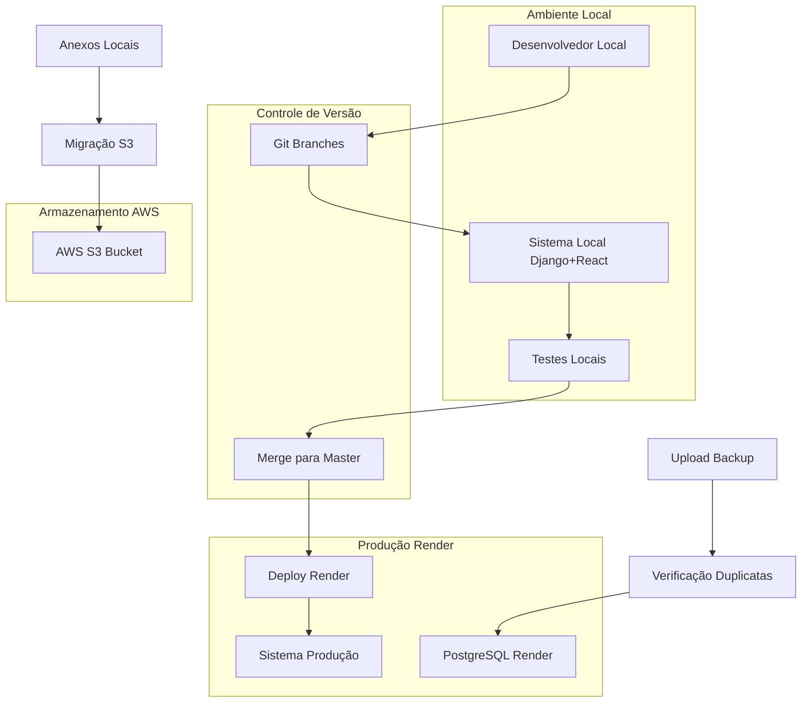
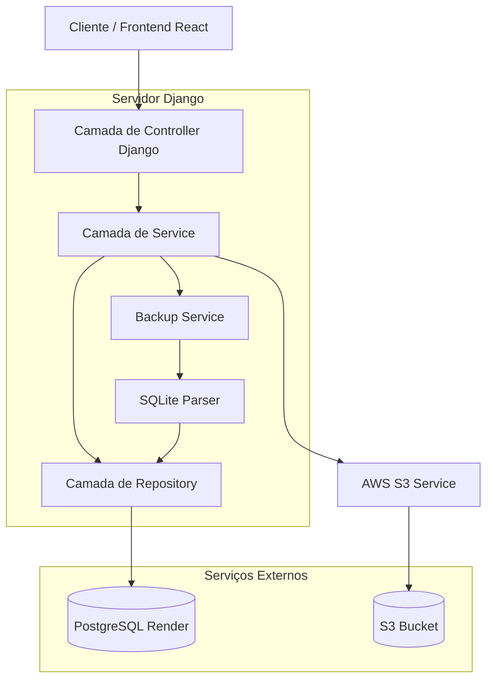
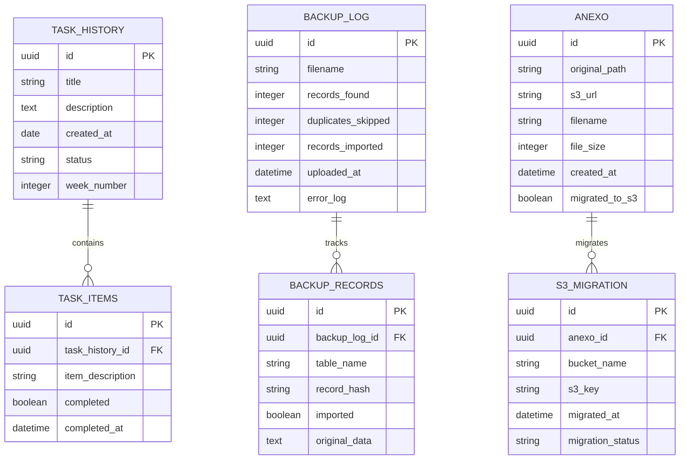

## 1. Design da Arquitetura



## 2. Descrição da Tecnologia

* Frontend: React\@18 + tailwindcss\@3 + vite

* Backend: Django\@4 + Django REST Framework

* Banco de Dados: PostgreSQL (Render) + SQLite (desenvolvimento local)

* Armazenamento: AWS S3 (anexos)

* Deploy: Render (automático via Git)

* Controle de Versão: Git com workflow de branches

## 3. Definições de Rotas

| Rota    | Propósito                                            |
| ------- | ---------------------------------------------------- |
| /admin  | Painel administrativo Django para gerenciamento      |
| /backup | Página de upload e migração de banco de dados        |
| /anexos | Gerenciamento de arquivos e migração para S3         |
| /docs   | Documentação interna e diretrizes de desenvolvimento |
| /tasks  | Controle e histórico de tarefas implementadas        |
| /health | Endpoint de saúde para monitoramento Render          |

## 4. Definições de API

### 4.1 API Principal

**Upload e Migração de Backup**

```
POST /api/backup/upload
```

Request:

| Nome do Parâmetro | Tipo   | Obrigatório | Descrição                                       |
| ----------------- | ------ | ----------- | ----------------------------------------------- |
| backup\_file      | file   | true        | Arquivo db.sqlite3 do cliente                   |
| merge\_strategy   | string | false       | Estratégia de merge (default: 'no\_duplicates') |

Response:

| Nome do Parâmetro | Tipo    | Descrição                                  |
| ----------------- | ------- | ------------------------------------------ |
| status            | boolean | Status da operação                         |
| duplicates\_found | integer | Número de registros duplicados encontrados |
| records\_imported | integer | Número de registros importados             |
| errors            | array   | Lista de erros encontrados                 |

**Migração de Anexos para S3**

```
POST /api/anexos/migrate-s3
```

Request:

| Nome do Parâmetro | Tipo   | Obrigatório | Descrição                 |
| ----------------- | ------ | ----------- | ------------------------- |
| source\_path      | string | true        | Caminho dos anexos locais |
| bucket\_name      | string | true        | Nome do bucket S3         |

Response:

| Nome do Parâmetro | Tipo    | Descrição                   |
| ----------------- | ------- | --------------------------- |
| status            | boolean | Status da migração          |
| files\_migrated   | integer | Número de arquivos migrados |
| total\_size       | string  | Tamanho total migrado       |

**Controle de Tarefas**

```
GET /api/tasks/history
POST /api/tasks/add
```

## 5. Diagrama da Arquitetura do Servidor



## 6. Modelo de Dados

### 6.1 Definição do Modelo de Dados



### 6.2 Linguagem de Definição de Dados

**Tabela de Histórico de Tarefas (task\_history)**

```sql
-- criar tabela
CREATE TABLE task_history (
    id UUID PRIMARY KEY DEFAULT gen_random_uuid(),
    title VARCHAR(200) NOT NULL,
    description TEXT,
    created_at TIMESTAMP WITH TIME ZONE DEFAULT NOW(),
    status VARCHAR(20) DEFAULT 'pending' CHECK (status IN ('pending', 'in_progress', 'completed', 'cancelled')),
    week_number INTEGER,
    updated_at TIMESTAMP WITH TIME ZONE DEFAULT NOW()
);

-- criar índices
CREATE INDEX idx_task_history_created_at ON task_history(created_at DESC);
CREATE INDEX idx_task_history_status ON task_history(status);
CREATE INDEX idx_task_history_week ON task_history(week_number DESC);

-- dados iniciais
INSERT INTO task_history (title, description, status, week_number) VALUES
('Organização do Projeto Render', 'Implementar workflow de branches e deploy seguro', 'in_progress', 1),
('Sistema de Backup com Upload', 'Criar funcionalidade de upload e merge de banco antigo', 'pending', 1),
('Migração de Anexos para S3', 'Implementar sistema de armazenamento AWS S3', 'pending', 1);
```

**Tabela de Log de Backup (backup\_log)**

```sql
CREATE TABLE backup_log (
    id UUID PRIMARY KEY DEFAULT gen_random_uuid(),
    filename VARCHAR(255) NOT NULL,
    records_found INTEGER DEFAULT 0,
    duplicates_skipped INTEGER DEFAULT 0,
    records_imported INTEGER DEFAULT 0,
    uploaded_at TIMESTAMP WITH TIME ZONE DEFAULT NOW(),
    error_log TEXT,
    processing_status VARCHAR(20) DEFAULT 'processing'
);

CREATE INDEX idx_backup_log_uploaded_at ON backup_log(uploaded_at DESC);
```

**Tabela de Anexos (anexo)**

```sql
CREATE TABLE anexo (
    id UUID PRIMARY KEY DEFAULT gen_random_uuid(),
    original_path VARCHAR(500),
    s3_url VARCHAR(500),
    filename VARCHAR(255) NOT NULL,
    file_size INTEGER,
    created_at TIMESTAMP WITH TIME ZONE DEFAULT NOW(),
    migrated_to_s3 BOOLEAN DEFAULT FALSE,
    content_type VARCHAR(100)
);

CREATE INDEX idx_anexo_migrated ON anexo(migrated_to_s3);
CREATE INDEX idx_anexo_created_at ON anex
```

