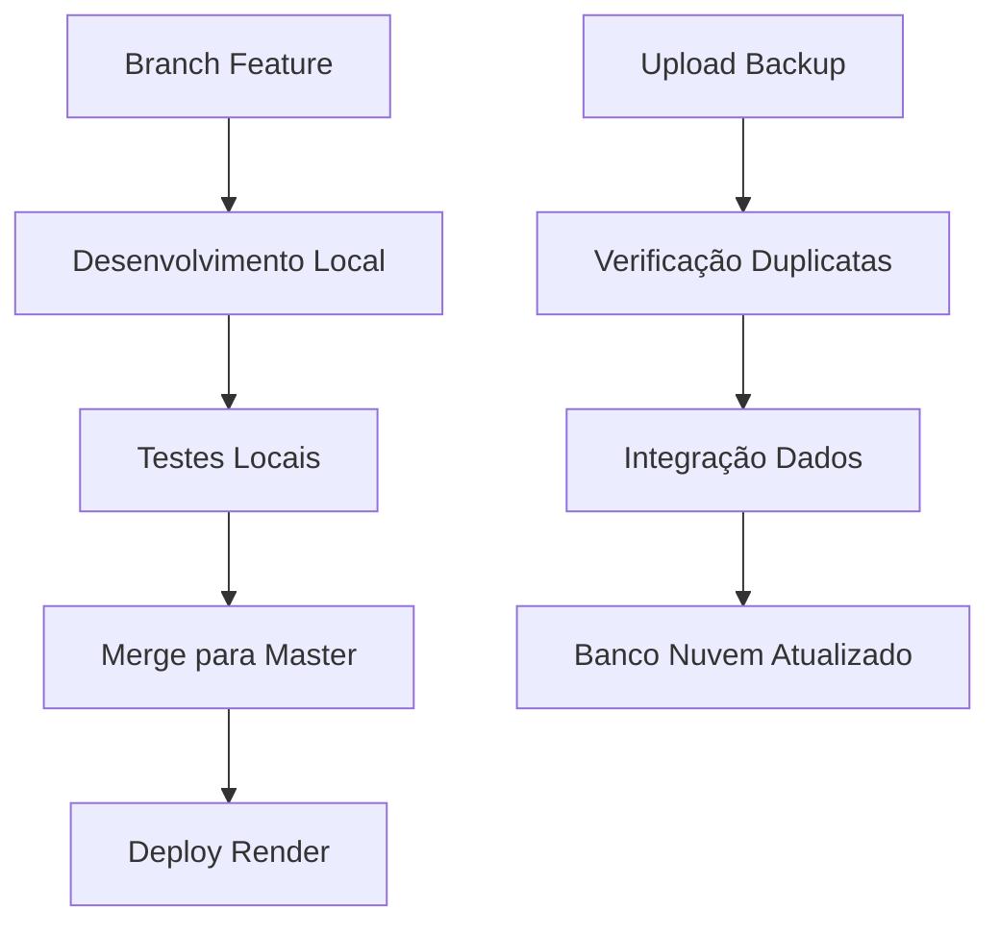

## 1. Visão Geral do Produto

Sistema de gestão organizacional Django+React com deploy 100% online no Render, focado em desenvolvimento seguro e confiável sem quebrar deploys com código não testado.

O projeto visa estabelecer um workflow de desenvolvimento profissional que garanta a estabilidade do sistema em produção, implementando práticas de versionamento, testes locais e integração de dados seguros.

## 2. Funcionalidades Principais

### 2.1 Papéis de Usuário

| Papel | Método de Registro | Permissões Principais |
|-------|-------------------|----------------------|
| Desenvolvedor | Acesso ao repositório Git | Pode criar branches, fazer commits, testar localmente |
| Administrador | Login no sistema web | Pode fazer backup, upload de dados, gerenciar sistema |

### 2.2 Módulo de Funcionalidades

Nossos requisitos de organização do projeto consistem nas seguintes páginas principais:

1. **Sistema de Branches**: workflow de desenvolvimento, controle de versão, merge para master.
2. **Ambiente Local de Desenvolvimento**: scripts de inicialização, configuração local, testes sem interferir na nuvem.
3. **Página de Backup e Migração**: upload de banco antigo, verificação de duplicatas, integração de dados.
4. **Sistema de Documentação**: diretrizes de desenvolvimento, práticas seguras, instruções constantes.
5. **Controle de Tarefas**: histórico de implementações, tracking de últimas 5 semanas/tarefas.
6. **Sistema de Anexos AWS**: integração com S3, armazenamento na nuvem, migração de arquivos.

### 2.3 Detalhes das Páginas

| Nome da Página | Nome do Módulo | Descrição da Funcionalidade |
|----------------|----------------|-----------------------------|
| Sistema de Branches | Controle de Versão | Criar branches de feature, testar mudanças, fazer merge seguro para master |
| Ambiente Local | Scripts de Desenvolvimento | Iniciar sistema localmente, configurar ambiente de teste, não interferir na nuvem |
| Backup e Migração | Upload de Dados | Fazer upload de db.sqlite3 antigo, verificar duplicatas, integrar dados sem conflitos |
| Documentação | Diretrizes CONTRIBUTING.md | Manter instruções constantes, práticas seguras, mindset cloud-first |
| Controle de Tarefas | Arquivo implementar.md | Rastrear últimas 5 tarefas/semanas, histórico de implementações |
| Sistema de Anexos | Integração AWS S3 | Migrar anexos para S3, armazenamento na nuvem, código de integração |

## 3. Processo Principal

**Fluxo de Desenvolvimento:**
1. Desenvolvedor cria branch de feature a partir da master
2. Implementa mudanças e testa localmente usando scripts atualizados
3. Verifica que código funciona tanto local quanto na nuvem
4. Faz merge para master após testes completos
5. Deploy automático no Render sem quebrar produção

**Fluxo de Backup:**
1. Administrador acessa página de backup
2. Faz upload do arquivo db.sqlite3 do cliente
3. Sistema verifica duplicatas automaticamente
4. Integra apenas dados novos ao banco da nuvem

## 4. Design da Interface do Usuário

### 4.1 Estilo de Design

- **Cores primárias e secundárias**: Azul profissional (#2563eb), cinza moderno (#64748b)
- **Estilo de botões**: Arredondados com sombra sutil
- **Fonte e tamanhos**: Inter, 14px para texto, 16px para botões
- **Estilo de layout**: Cards com bordas suaves, navegação superior limpa
- **Ícones**: Feather icons para consistência visual

### 4.2 Visão Geral do Design das Páginas

| Nome da Página | Nome do Módulo | Elementos da UI |
|----------------|----------------|----------------|
| Sistema de Branches | Controle de Versão | Lista de branches ativas, botões de merge, status indicators verdes/vermelhos |
| Ambiente Local | Scripts de Desenvolvimento | Terminal integrado, botões de start/stop, logs em tempo real |
| Backup e Migração | Upload de Dados | Área de drag-and-drop, barra de progresso, relatório de duplicatas |
| Documentação | Diretrizes | Markdown renderizado, navegação lateral, busca integrada |
| Controle de Tarefas | Histórico | Timeline vertical, cards de tarefas, filtros por data |
| Sistema de Anexos | AWS S3 | Preview de arquivos, status de upload, configurações de bucket |

### 4.3 Responsividade

O sistema é desktop-first com adaptação mobile para administradores que precisam acessar backups e monitoramento remotamente. Otimização touch para upload de arquivos e navegação em dispositivos móveis.